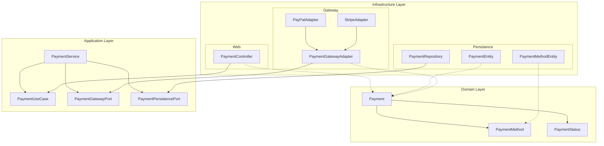
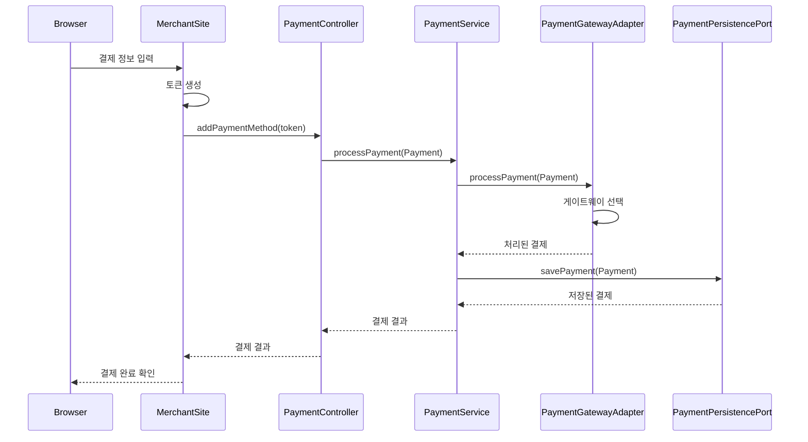
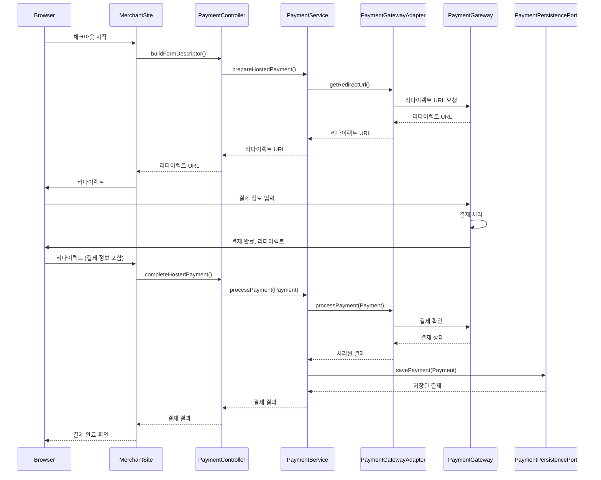
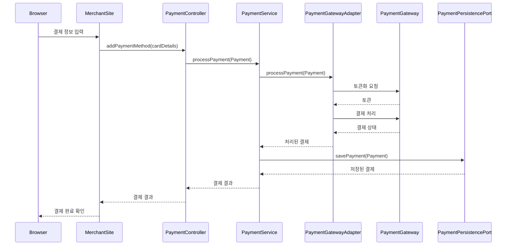
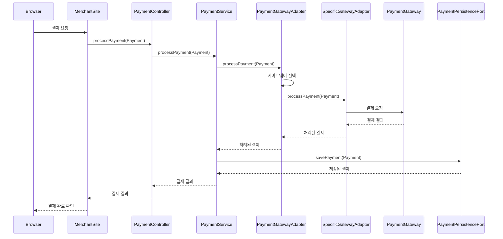

도메인 레이어: 
Payment, PaymentMethod, PaymentStatus 등 핵심 도메인 모델

애플리케이션 레이어:
PaymentUseCase: 결제 관련 유스케이스를 정의하는 인터페이스
PaymentService: 실제 비즈니스 로직을 구현하는 서비스
PaymentGatewayPort: 결제 게이트웨이와의 통신을 추상화하는 포트
PaymentPersistencePort: 결제 정보 영속성을 추상화하는 포트

인프라스트럭처 레이어:
Web: PaymentController가 외부 요청을 처리합니다.
Persistence: PaymentEntity, PaymentMethodEntity, PaymentRepository가 데이터 영속성
Gateway: PaymentGatewayAdapter, PayPalAdapter, StripeAdapter가 실제 결제 게이트웨이와의 인터페이스 구현

레이어 간 관계:
애플리케이션 레이어는 도메인 모델을 사용합니다.
인프라스트럭처 레이어는 애플리케이션 레이어의 인터페이스(포트)를 구현합니다.
의존성 방향이 항상 내부(도메인)를 향하고 있어야 하며 이는 헥사고날 아키텍처의 원칙에 따라 디자인되었음

클라이언트 측 토큰화 (Client-Side Tokenization)

호스팅된 결제 페이지 (Hosted Payment Page)

서버 측 토큰화 (Server-Side Tokenization)

게이트웨이 통합 흐름 (Gateway Integration Flow)

